# Northwind-Traders-Sales-Analysis

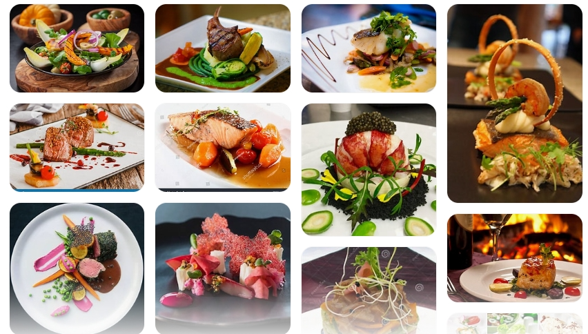

## Introduction
The Power BI project focuses on analyzing the sales of "Northwind Traders" to improve operations and decision-making in the second half of 2015.

''_Disclaimer_'': _All datasets and reports do not represent any company, institution or country, but just a dummy dataset to demostrate capabilities of Power Bi._

## Problem Statement
1.	What are the total sales figures for the first half of 2015?
2.	Which months showed the highest and lowest sales
3.	Which cities have the highest sales, and which are underperforming?
4.	How do sales vary between the USA and UK markets?
5.	Are there differences in how customers from different cities or regions purchase products?
6.	Which customer segments are contributing the most to sales?
7.	Which products are selling the most during the first half of 2015?

## Skills/ concepts demostrated

The following Power Bi features were integrated:
- Bookmarking
- Dax
- Quick measures
- Modelling
- Filters

## Daata sourcing
An imaginary shopping data set

## Data Transformation
- I made sure that each field (data, text, integer, binary, etc.) in the dataset was formatted correctly.
- I performed data cleansing and duplication removal in Power Bi to get the data ready for analysis.
- I removed the columns and rows that were necessary for the analysis.

## Modelling

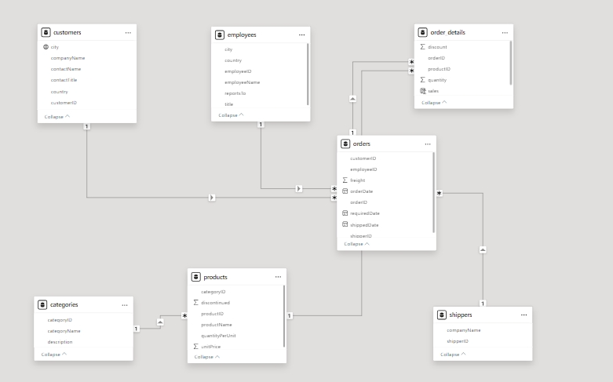

## Analysis and Visualisation
Using different types of charts such as Doughnut, Bar, and Pie charts led to various discoveries.

## Product performance
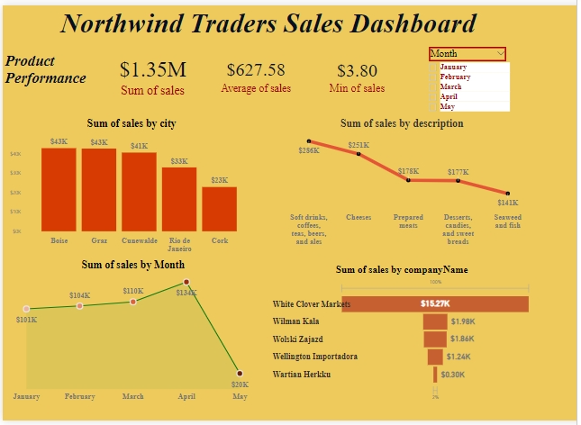

## sum of sales by month
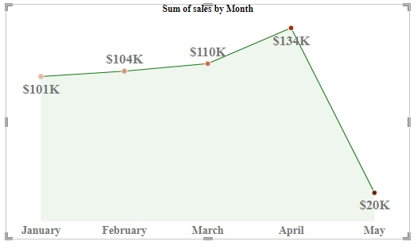

## sum of sales by description
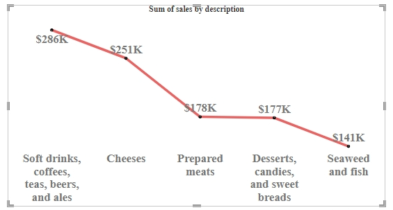

## sum of sales by city
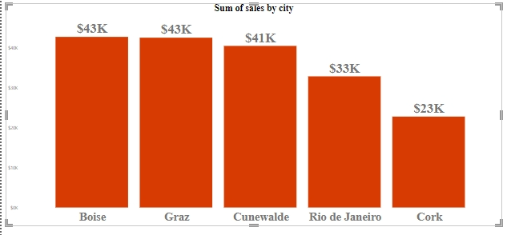

## Sum of sales by CompanyName
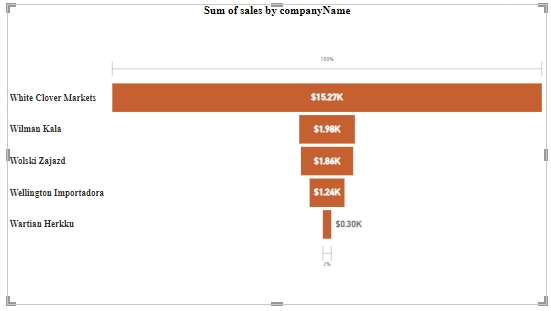

## Product Performance in April
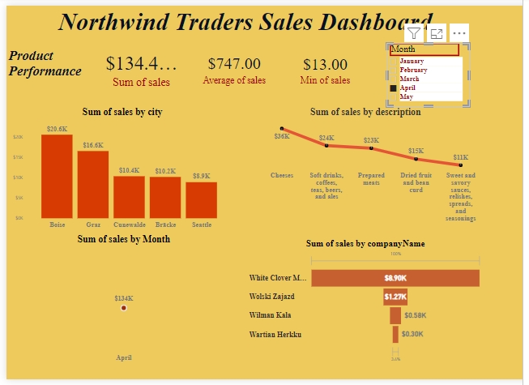

## Customer Performance
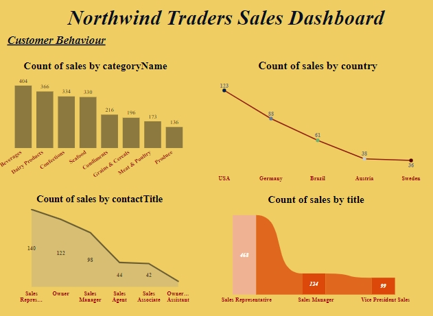

## Count by country
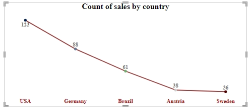

## Count by Title
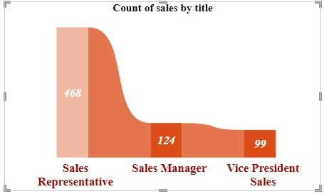

## Count by categoryName
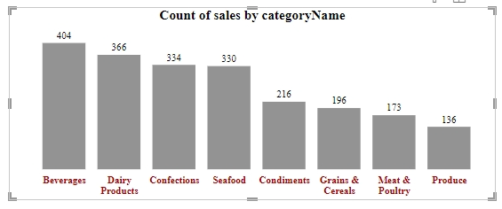

## Findings 
The sales performance data for Northwind traders reveals a total sales figure of $1.35m with an average sales amount of $627 58. Notable city contributors include Cork and Graz each with sales surpassing $40,000. In terms of product categories, the top sellers were beverages dairy and seafood. White clover markets lead in company sales contributing over $15,000. April recorded the highest sales among the months analyzed.

## Conclusion
The business is doing well with strong beverage and dairy sales, there are significant opportunities for growth in underperforming areas and the variety of products sold in March also stands out as a month if particularly high indicating a seasonal trend or potential for media success

## Recommendations:
- Focus on underperforming areas: Cities like Rio de Janeiro and Cunevalde have limited sales. Marketing efforts and promotions should target these areas to increase productivity
- Diversification: Though beverages are the dominant product category, investments to promote other categories such as limited sales of spices products can contribute to the revenue generation various.
- Take advantage of higher sales: Products such as beverages and seafood that contribute significantly to sales should be promoted more through bundles or discounts to maximize revenue.
- Customer engagement: Many communication strategies, such as loyalty programs or personalized offers, can be used to retain high-end customers such as White Clover Market and turn them into high-spenders.

## Ways to increase sales:
- Promotional discounts: -Running time-limited offers during off-peak sales months can provide urgency and increase sales.
- Targeted marketing: Use customer behavior data to send personalized marketing messages that reflect their buying habits and preferences.
- Expand into new markets: Identify untapped areas or less popular products and focus on marketing to drive growth.

